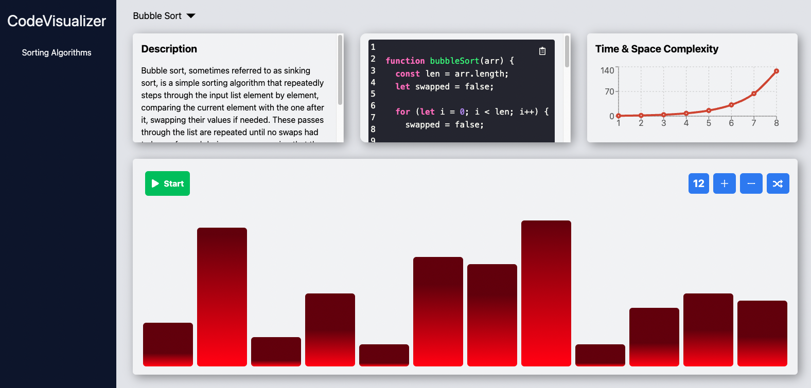

# Code Vision

Code Vision is an interactive web application designed to help users visualize and understand various sorting algorithms. This app displays a dashboard with a dropdown menu to select the desired sorting algorithm, accompanied by four information cards providing a description, code, time & space complexity, and an animated bar graph.

The primary motivation behind building this app is to create a learning tool and a personal note repository for search and sorting algorithms. As a developer, I have always been fascinated by these algorithms, and this project allows me to explore new concepts and share them with others.

## Features

- Dashboard with dropdown menu for selecting a sorting algorithm
  - 4 Information cards:
  - Description of the algorithm
  - Code implementation
  - Time & space complexity
  - Animated bar graph demonstrating the selected algorithm

## Tech Stack

- TypeScript
- Next.js
- Jest (for unit testing)
- Tailwind CSS

## Future Features

We are always looking to improve Code Vision and add more functionality. Some of the planned features include:

- Adding more sorting algorithms
- Implementing search algorithms
- Comparing multiple algorithms side by side
- Enhancing the visualization and animations
- Dark mode support

## Contributions

Code Vision welcomes contributions from the community. If you're interested in contributing, please follow these steps:

1. Fork the repository
2. Create a new branch for your feature or bugfix
3. Make your changes, ensuring that your code is clean and well-documented
4. Add any necessary tests for your changes
5. Submit a pull request to the main branch with a clear description of your changes
6. Before contributing, please ensure that your changes are in line with the project's goals and tech stack.

## Why Code Vision?

I built this app because I have always been fascinated with search and sorting algorithms. As a developer, I wanted to create a tool that not only helps me learn and understand these algorithms better but also allows me to share my learnings with others. The project serves as a platform for me to explore new concepts, experiment with different technologies, and maintain notes on everything I learn along the way.

Thank you for your interest in Code Vision! Happy learning!
